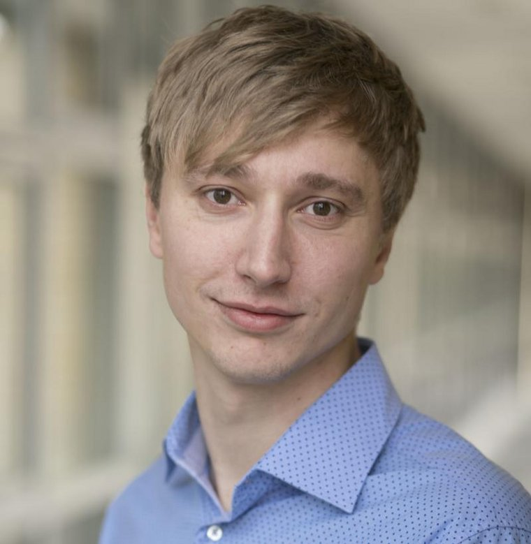
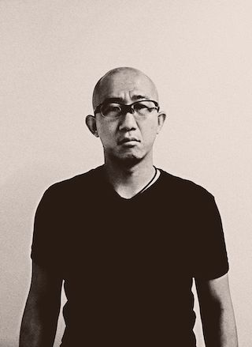

## Organizing Committee

  

    

      
      

        <h5 class="card-title">Sherzod Hakimov</h5>
        
University of Potsdam, Germany <a href="https://sherzod-hakimov.github.io">Website</a>

      

    

  

 

    

      
      

        <h5 class="card-title">David Semedo</h5>
        
NOVA University of Lisbon, Portugal <a href="https://muws-workshop.github.io/organization/">Website</a>

      

    

  

  

    

      
      

        <h5 class="card-title">Marc A. Kastner</h5>
        
Hiroshima City University, Japan <a href="https://www.marc-kastner.com">Website</a>

      

    

  

  
  

    

      
      

        <h5 class="card-title">Eric Müller-Budack</h5>
        
L3S Research Center, Leibniz University Hannover, Germany <a href="https://www.researchgate.net/profile/Eric-Mueller-Budack">Website</a>

      

    

  

  

    

      
      

        <h5 class="card-title">Takahiro Komamizu</h5>
        
Nagoya University, Japan <a href="https://taka-coma.pro/">Website</a>

      

    

  

## Programme Committee

- Christian Otto, L3S Research Center, Germany
- Özge Alaçam, Bielefeld University, Germany
- Tuomo Hiippala, University of Helsinki, Finland
- Chihaya Matsuhira, Nagoya University, Japan
- Nils Murrugarra-Llerena, Weber State University, USA
- Arka Ujjal Dey, Computer Vision Center, Spain
- Ricardo Marcacini, University of Sao Paulo, Brazil
- Janina Wildfeuer, University of Groningen, Netherlands
- Raffaella Bernardi, University of Trento, Italy
- Antonio Tejero-de-Pablos, Cyber Agent Inc., Japan
- Philipp Sadler, University of Potsdam, Germany
- Nikolai Ilinykh, University of Gothenburg, Sweden
- Yankun Wu, Osaka University, Japan
- Sandro Pezzelle, University of Amsterdam, Netherlands

If you have any problems or questions, please contact us via e-mail at: [tbd@tbd.com](tbd@tbd.com)
