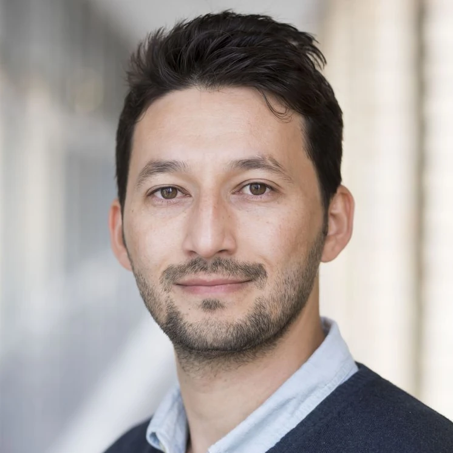
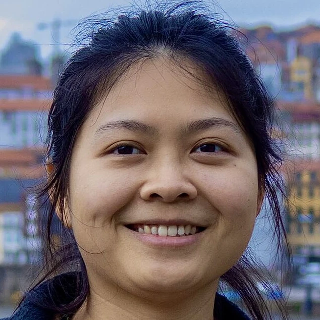

## Organizing Committee

  

    

      
      

        <h5 class="card-title">Sherzod Hakimov</h5>
        
University of Potsdam, Germany <a href="https://sherzod-hakimov.github.io">Website</a>

      

    

  

  

    

      
      

        <h5 class="card-title">Eric Müller-Budack</h5>
        
TIB – Leibniz Information Centre for Science and Technology, Hannover, Germany <a href="https://www.tib.eu/en/research-development/research-groups-and-labs/visual-analytics/staff/eric-mueller-budack">Website</a>

      

    

  

  <!-- 

    

      
      

        <h5 class="card-title">David Semedo</h5>
        
NOVA University of Lisbon, Portugal <a href="https://muws-workshop.github.io/organization/">Website</a>

      

    

  
 -->

  

    

      
      

        <h5 class="card-title">Marc A. Kastner</h5>
        
Hiroshima City University, Japan <a href="https://www.marc-kastner.com">Website</a>

      

    

  

  

    

      
      

        <h5 class="card-title">Takahiro Komamizu</h5>
        
Nagoya University, Japan <a href="https://taka-coma.pro/">Website</a>

      

    

  

  

    

      
      

        <h5 class="card-title">Jing Yang</h5>
        
TU Berlin, Germany <a href="https://www.tu.berlin/en/qu/ueber-uns/team-personen/senior-researchers/dr-jing-yang">Website</a>

      

    

  

  

    

      
      

        <h5 class="card-title">Matthias Springstein</h5>
        
TIB – Leibniz Information Centre for Science and Technology, Hannover, Germany <a href="https://www.tib.eu/en/research-development/research-groups-and-labs/visual-analytics/staff/matthias-springstein">Website</a>

      

    

  

If you have any problems or questions, please contact us via e-mail: [muws-workshop@listserv.dfn.de](mailto:muws-workshop@listserv.dfn.de)
