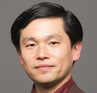
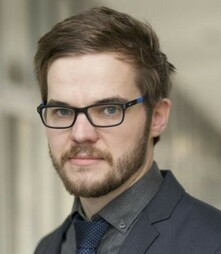

The 1st International Workshop on Multimodal Understanding for the Web and Social Media (MUWS), co-located with The WebConf (WWW) 2022

- Participation: Online

- Workshop Date: April 26, 2022

- Workshop Proceedings: https://dl.acm.org/doi/abs/10.1145/3487553.3524873

## Workshop Recordings



## Program

- **14:00 - 14:05** - Welcome session

- **14:05 - 14:50** - Keynote talk by Ichiro Ide "Tailoring Applications to Users Through Multi-modal Understanding"

  

      

              
      

      

              

                 Prof. Ichiro Ide received his BEng, MEng, and PhD from The University of Tokyo in 1994, 1996, and 2000, respectively. He became an Assistant Professor at the National Institute of Informatics, Japan in 2000. Since 2004, he has been an Associate Professor, and since 2020, a Professor at Nagoya University. His research interest ranges from the analysis and indexing to retargeting of multimedia contents, especially in large-scale broadcast video archives, mostly on news, cooking, and sports contents.
              

       

  

- **14:50 - 15:15** - Invited talk by Chiao-I Tseng "Multimodal Discourse Approach to Narrative Strategies of Online News Videos"

  

      

              
      

      

              

                 Dr. Chiao-I Tseng is a multimodal linguist and senior researcher in the Faculty of Linguistics and Literary Sciences at the University of Bremen. She completed my PhD in Applied Linguistics at the University of Bremen in 2010. She specialises in developing discourse methods for analysing visual and audiovisual text structures and contents, particularly the methods for multimodal cohesion and coherence, events actions, narrative time and space.
              

       

  

- **15:15 - 15:30** - Mesut Erhan Unal, Adriana Kovashka, Wen-Ting Chung and Yu-Ru Lin "Visual Persuasion in COVID-19 Social Media Content: A Multi-Modal Characterization"

- **15:30 - 15:45** - Break

- **15:45 - 16:05** - Invited talk by Christian Otto "Characterization and Classification of Semantic Image-Text Relations"

  

      

              
      

      

              

                 Christian Otto is a doctoral researcher working at Visual Analytics Group, TIB. His research topic is the examination of cross-modal interrelations between visual and textual information. This includes the consideration of insights from communication sciences, the research design of deep learning applications to analyse multimodal information and the incorporation of this knowledge into search engines, such as for scientific publications or scientific videos.
              

       

  

- **16:05 - 16:20** - Shivangi Singhal, Tanisha Pandey, Saksham Mrig, Rajiv Ratn Shah and Ponnurangam Kumaraguru "Leveraging Intra and Inter Modality Relationship for Multimodal Fake News Detection"

- **16:20 - 16:35** - Kohei Uehara, Yusuke Mori, Yusuke Mukuta and Tatsuya Harada "ViNTER: Image Narrative Generation with Emotion-Arc-Aware Transformer"

- **16:35 - 16:50** - Diego Garcia-Olano, Yasumasa Onoe and Joydeep Ghosh "Improving and Diagnosing Knowledge-Based Visual Question Answering via Entity Enhanced Knowledge Injection"

- **16:50 - 17:00** - Closing session

## Organizing Committee

- Sherzod Hakimov
- Gullal S. Cheema
- Marc A. Kastner
- Rajiv Ratn Shah
- Karan Sikka
